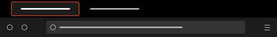

# Frontend Delight theme for Firefox

This is my favorite color scheme, Frontend Delight, for Firefox.

It contains two files:

- manifest.json: a normal Firefox theme
- userChrome.css: a better version, but using userChrome

